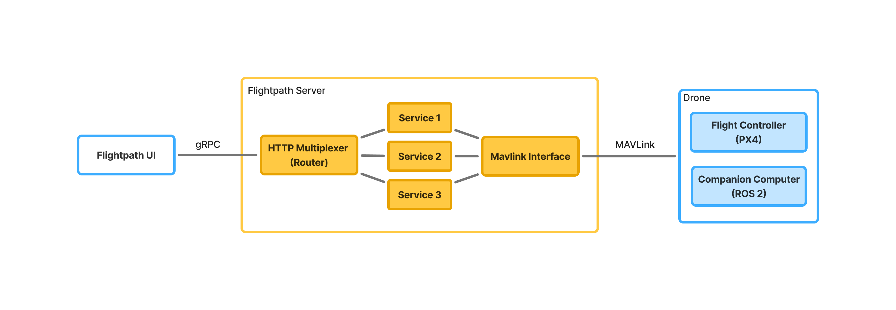

# Flightpath

Go platform exposing a gRPC API to control a drone.

## Architecture



## Project Structure
```
flightpath/
├── cmd/
│   └── server/
│       └── main.go                 # Server entry point
├── examples/                       # API usage examples
│   └── message_monitor.go
├── gen/                            # Generated files
│   ├── go/flightpath
│   |   ├── action_pb.go
│   |   ├── connection_pb.go
│   |   └── telemetry_pb.go
│   └── ts/flightpath
│       ├── action_pb.go
│       ├── connection_pb.go
│       └── telemetry_pb.go
├── internal/
│   ├── config/
│   │   ├── config.go               # Configuration structure
│   │   └── loader.go               # Configuration loader
│   ├── mavlink/
│   │   └── mavlink_connector.go    # Drone interface using MAVLink
│   ├── middleware/
│   │   ├── cors.go                 # CORS middleware
│   │   ├── logging.go              # Request logging
│   │   └── recovery.go             # Panic recovery
│   ├── server/
│   │   └── server.go               # Represents the flightpath server
│   └── services/
│       ├── context.go              # Shared context for all services (config, logger, etc.)
│       ├── action.go               # Handles drone actions
│       ├── connection.go           # Handles drone connection
│       └── telemetry.go            # Handles drone telemetry
├── proto/
│   └── flightpath/
│       ├── action.proto            # Drone actions
│       ├── connection.proto        # Drone connection
│       └── telemetry.proto         # Drone telemetry
├── go.mod
└── go.sum
```

## Quick Start
```bash
# 1. Clone repository
git clone https://github.com/flightpath-dev/flightpath
cd flightpath

# 2. Install dependencies
go mod tidy

# 3. Start a PX4 SITL (see docs/px4-sitl-setup.md)
See [PX4 SITL Setup](docs/px4-sitl-setup.md)

# 4. Run server
go run cmd/server/main.go

# 4. Monitor messages from the PX4 SITL
go run examples/monitor_heartbeat_flightpath/main.go
```

## Development

## License

MIT
