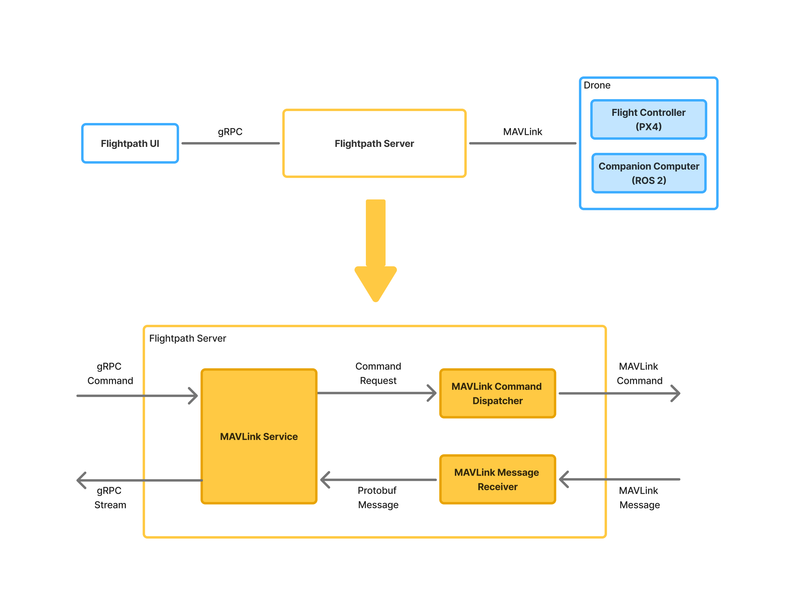

# Flightpath — Autonomous Drone Control Platform

A Go-based server for autonomous drone control via the MAVLink protocol. For the front-end, see the [Flightpath UI](https://github.com/flightpath-dev/flightpath-ui) repository.

## Architecture



## Project Structure
```
flightpath/
├── cmd/                            # Main applications for this project
│   └── server/                     # Server entry point
│       └── main.go
├── examples/                       # API usage examples
├── gen/                            # gRPC code generated from protobufs
│   ├── go/
│   └── ts/
├── internal/                       # Private application and library code
│   ├── config/
│   │   ├── config.go               # Configuration structure
│   │   └── loader.go               # Configuration loader
│   ├── logger/                     # Structured logger based on slog
│   │   └── logger.go
│   ├── mavlink/                    # Drone side communication code
│   │   ├── command_dispatcher.go   # Sends commands to drone
│   │   └── message_receiver.go     # Receives messages from Drone
│   ├── middleware/                 # Handlers to process HTTP requests
│   │   ├── cors.go                 # CORS middleware
│   │   ├── logging.go              # Request logging middleware
│   │   └── recovery.go             # Panic recovery middleware
│   ├── server/                     # Server state and lifecycle management
│   │   └── server.go
│   └── services/                   # Core functionality offered by the application
│       ├── context.go              # Shared context for all services (config, logger, etc.)
│       └── mavlink_service.go      # Distributes MAVLink messages to gRPC subscribers
├── proto/                          # Protocol Buffers definitions
│   └── flightpath/
│       └── mavlink_service.proto   # Handles commands and messages from gRPC clients
├── go.mod
└── go.sum
```

## Quick Start

### Prerequisites

```bash
# 1. Clone repository
git clone https://github.com/flightpath-dev/flightpath
cd flightpath

# 2. Install dependencies
go mod tidy
```

### Run with a PX4 SITL

Start a PX4 SITL by following the instructions in [PX4 SITL Setup](docs/px4-sitl-setup.md).

```bash
# 1. Run server
go run cmd/server/main.go

# 2. Monitor messages from the SITL
go run examples/message_monitor_flightpath/main.go
```

See sample logs:
- [from SITL](./docs/mavlink-message-monitor-log-sitl.txt)
- [from live vehicle](./docs/mavlink-message-monitor-log-live-vehicle.txt)

### Run with a drone connected to a serial port

```bash
# 1. Turn on the drone

# 2. Run the server with a serial port configuration 
./scripts/run-serial.sh

# 3. Monitor messages from the drone
go run examples/message_monitor_flightpath/main.go
```

### Run with a drone connected over a UDP port

```bash
# 1. Turn on the drone

# 2. Run the server with a UDP configuration
./scripts/run-udp.sh

# 3. Monitor messages from the drone
go run examples/message_monitor_flightpath/main.go
```

## Configuration

Flightpath uses environment variables for configuration, following the 12-factor app pattern.

### Server Configuration

- **FLIGHTPATH_GRPC_HOST**: gRPC server host (string, default: "0.0.0.0")
- **FLIGHTPATH_GRPC_PORT**: gRPC server port (integer, 1-65535, default: 8080)
- **FLIGHTPATH_GRPC_CORS_ORIGINS**: Comma-separated list of allowed CORS origins (default: "http://localhost:3000")

### MAVLink Configuration

- **FLIGHTPATH_MAVLINK_ENDPOINT_TYPE**: MAVLink endpoint type (string, required, default: `udp-server`)
  - Valid values: `serial`, `udp-server`, `udp-client`, `tcp-server`, `tcp-client`

#### Serial Endpoint

- **FLIGHTPATH_MAVLINK_SERIAL_DEVICE**: Serial device path (string, required if type is "serial")
  - Example: `/dev/cu.usbserial-D30JAXGS` (Mac), `/dev/ttyUSB0` (Linux) or `COM3` (Windows)
- **FLIGHTPATH_MAVLINK_SERIAL_BAUD**: Serial baud rate (integer, required if type is "serial", default: 57600)
  - Example: `57600`, `115200`

#### UDP Endpoint

- **FLIGHTPATH_MAVLINK_UDP_ADDRESS**: UDP address in "host:port" format (string, required for UDP endpoints, default: "0.0.0.0:14550")
  - Example: `0.0.0.0:14550` (server) or `127.0.0.1:14550` (client)

#### TCP Endpoint

- **FLIGHTPATH_MAVLINK_TCP_ADDRESS**: TCP address in "host:port" format (string, required for TCP endpoints)
  - Example: `0.0.0.0:5760` (server) or `127.0.0.1:5760` (client)

### Logging Configuration

- **FLIGHTPATH_LOG_LEVEL**: Log level (string, case-insensitive, default: "INFO")
  - Valid values: `DEBUG`, `INFO`, `WARN`, `ERROR`
  - Example: `export FLIGHTPATH_LOG_LEVEL=DEBUG`
- **FLIGHTPATH_LOG_FORMAT**: Log format (string, case-insensitive, default: "text")
  - Valid values: `text`, `json`
  - `text`: Short, human-readable format (e.g., `INFO [main] Starting the server`)
  - `json`: Structured JSON format for log aggregation tools
  - Example: `export FLIGHTPATH_LOG_FORMAT=json`

### Example Configuration

```bash
# Server configuration
export FLIGHTPATH_GRPC_HOST=0.0.0.0
export FLIGHTPATH_GRPC_PORT=8080
export FLIGHTPATH_GRPC_CORS_ORIGINS=http://localhost:3000,http://localhost:4000

# MAVLink serial configuration
export FLIGHTPATH_MAVLINK_ENDPOINT_TYPE=serial
export FLIGHTPATH_MAVLINK_SERIAL_DEVICE=/dev/cu.usbserial-D30JAXGS
export FLIGHTPATH_MAVLINK_SERIAL_BAUD=57600

# Or MAVLink UDP configuration
export FLIGHTPATH_MAVLINK_ENDPOINT_TYPE=udp-server
export FLIGHTPATH_MAVLINK_UDP_ADDRESS=0.0.0.0:14550

# Logging configuration
export FLIGHTPATH_LOG_LEVEL=WARN
export FLIGHTPATH_LOG_FORMAT=text
```

## Testing

Run all tests:

```bash
go test ./...
```

Run tests with coverage:

```bash
go test -cover ./...
```

Run tests with verbose output:

```bash
go test -v ./...
```

## License

MIT
